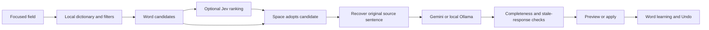

# Passport

Learn a language where you already type.

Passport is a Firefox/Zen extension that suggests translated words inside webpage text fields, then uses an optional sentence model to repair grammar and meaning. Explore definitions, readings and pronunciation without copying your draft into a separate translator.

**Status: prototype, version 0.3.2.** Automated tests pass; the latest repair still needs a recorded live Zen retest. Chrome, system-wide typing and universal website compatibility are not supported releases.

## Demo

**Video coming soon.** No filmed demo has been supplied yet. The [recording plan](docs/DEMO-PLAN.md) covers real typing, vocabulary inspection, sentence reconstruction and practice. Replace this paragraph with a real uploaded video link and optional poster after recording; do not publish a placeholder video URL.

## Features

- English, Spanish, French, Japanese and Mandarin, with interchangeable source/target languages and optional source detection.
- Offline word suggestions while typing; Tab cycles candidates and Space adopts the current option without waiting for a cloud response.
- Optional Jev contextual ranking, plus Gemini or local Ollama sentence reconstruction.
- Word meanings and available readings; pronunciation through installed local system voices.
- Practice approximate target spelling, Japanese romaji and Mandarin pinyin. Pinyin tones are optional.
- Fixed/floating companion, globe language selector, Undo, on/off switch, custom accents and reduced-motion support.
- First-run setup and a hands-on tutorial using the actual companion.

## Install in Firefox or Zen

Use a browser based on Firefox 142 or newer.

1. Clone this repository, or download a released XPI if one has been published.
2. Open `about:debugging#/runtime/this-firefox`.
3. Select **Load Temporary Add-on…** and choose `lilt-firefox/manifest.json` or the XPI.
4. Complete setup, or skip connections for offline vocabulary.
5. Refresh webpages opened before installation/reload.

The unsigned development extension must be loaded again after restarting the browser. Public distribution requires signing and further testing. The internal `lilt` directory and add-on ID remain for compatibility; the visible name is Passport.

**Upgrading from 0.3.0/0.3.1:** close every old Passport Settings/setup tab before loading 0.3.2, then refresh webpages. An old Settings listener could intercept dictionary and translation replies. You do not need to delete stored keys or settings.

## Connections and cost

| Mode | Setup | Processing |
|---|---|---|
| Offline words | None | Bundled dictionaries on the device |
| Gemini sentences | Google AI Studio key and Google consent in Settings | Current sentence/original wording sent to Google |
| Ollama sentences | Local server/model, loopback endpoint, Refresh models and select | Requests sent to the local server |
| Optional Jev ranking | TypeSafe key and separate live-ranking consent | Word, up to 600 context characters and up to ten candidates sent to TypeSafe |

New configurations default to `gemini-3.8-flash`; saved model choices are preserved. Use **Save and test sentence translation** to verify model access. Cloud requests may cost money. Passport has no developer-hosted backend or shared database.

For Ollama 403 errors, allow this installation's `moz-extension://` origin and restart the existing server. Starting a second server on the same port causes an address-in-use error. `OLLAMA_NO_CLOUD=1` disables Ollama cloud use; enabled Jev remains a separate cloud service.

## Typing controls

| Action | Behavior |
|---|---|
| Type | Local prefix/spelling candidates appear where coverage exists |
| Tab / Shift+Tab | Cycle word candidates |
| Space | Adopt the current word candidate or eligible ready sentence preview |
| Pause 0.5 seconds | Start sentence reconstruction; provider time comes afterward |
| End with `.`, `?` or `!` | Start reconstruction immediately, with heuristic decimal/abbreviation/URL guards |
| Continue typing | Dismiss a no-boundary preview and continue the draft |
| Enter | Native send/search; cancel pending replacement |
| Click a translated word | Inspect its explanation and available pronunciation |
| Undo arrow | Recover an earlier visible draft state |

A complete result without a trailing word boundary stays a preview. Space accepts it. At a boundary it can apply automatically only if text, caret, focus and version still match. If it changes an explicit Tab/click choice, review and accept with the checkmark. A pause alone does not prove completeness.

For new-tab searches: **Ctrl+T → `pp` → Space**, then type. This uses Firefox's own suggestion rows; the webpage companion cannot overlay browser chrome.

## How it works



Dictionaries supply candidates; Jev selects among them; the sentence model can correct senses as well as grammar. Automatic guesses do not replace the original source as the model's only input.

Read the [architecture](docs/ARCHITECTURE.md), [release history](CHANGELOG.md) and [design report](docs/DESIGN-REPORT.md).

## Development

Runtime code is plain JavaScript, HTML and CSS; no React build step is required. Use Node.js 24+, npm and Python 3.

```sh
npm install
npm test
npm run lint
npm run package
npm run dev
# For a specific Zen/Firefox executable:
npm run dev -- --firefox /path/to/zen
```

Commit the lockfile generated by `npm install` before using `npm ci` in CI. Dependency versions are pinned; no lockfile has been fabricated. The tests mock providers and make no paid requests. Historical benchmark scripts are separate and can incur cloud usage if explicitly run.

The ordinary XPI does not hot reload. The developer runner uses a separate profile unless configured otherwise. Packaging writes the XPI and checksum to `dist/`; attach them to a GitHub Release rather than source history.

## Validation and limitations

- The retained full suite passed **116 tests**; extension lint reported zero errors, warnings or notices. These are automated checks, not proof of live website compatibility.
- The open-Settings messaging regression has dedicated tests. A specific successful live Zen retest is not recorded.
- Targets standard text/search inputs, textareas and supported contenteditable editors. Protected pages, browser chrome, closed shadow roots and canvas editors are outside normal scope. Instagram and other custom editors need live testing.
- Dictionaries, language detection, names, morphology and phonetic matching are incomplete. Non-English pairs may bridge through English and mix senses. The English `-ing` fallback is narrow, not a general grammar analyzer.
- Some entries lack readings; voices depend on the system. Model character explanations may be wrong; Ollama currently omits character analyses.
- Late results are discarded. Interior edits can invalidate source mappings; Undo is not a permanent document history.
- Fixed placement can overlap sticky website controls; floating mode and gap controls may help.

See the [live checklist](docs/VALIDATION.md). The [24-phrase pilot](passport-benchmark/REPORT.md) is exploratory, not a general accuracy or latency claim for this release.

## Data and licensing

The bundle contains 361,132 bilingual rows, not that many unique words. Preserve the [third-party notices](THIRD-PARTY-NOTICES.md), source snapshots and derivative-data licenses.

The owner has not selected a license for original Passport code. No MIT or other code license is implied. Choose one before inviting reuse; dictionary terms remain separate.
